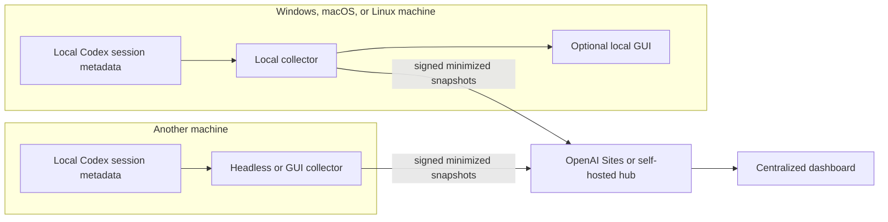

<p align="center">
  
</p>

# Local Usage Dashboard for Codex

Local Usage turns the Codex session metadata stored on your computer into a fast, privacy-conscious usage dashboard. It can run entirely on one machine, or several machines can send signed, minimized usage snapshots to an optional central dashboard hosted with OpenAI Sites or on your own server.

[**Stable release 1.2.0**](https://github.com/capisoft-lib/codex_usage/releases/tag/v1.2.0) · [Docker image 1.2.0](https://hub.docker.com/r/capitaine/codex-usage-dashboard) · [AGPL-3.0-or-later](LICENSE) · [Changelog](CHANGELOG.md) · [CI status](https://github.com/capisoft-lib/codex_usage/actions/workflows/ci.yml)

## What the application shows

- API-equivalent cost using the observed Standard or Fast service tier, split between fresh input, cached input, and output;
- estimated ChatGPT Codex credits, including the observed Fast-mode multiplier for each call;
- projects, conversations, model calls, turns, duration, tokens, cache rate, and cost share;
- hourly, daily, and monthly activity charts with click-to-zoom drill-down;
- a transient **Custom** date range while drilling into a chart, applied to the rest of the page without overwriting the user's saved Custom range;
- current and historical weekly quota periods, including the subscription tier observed during each period;
- early or free-reset boundaries, hourly activity bars, cumulative quota consumption, and a projection to the end of the current quota period;
- filters by project, model, period, usage, and conversation name.

The interface is available in French, English, German, Spanish, Italian, Portuguese, Japanese, Russian, and Simplified Chinese. The browser language is used on first visit when supported. Explicit language choices, date preferences, and custom pricing remain in browser storage.

The server indexes sessions incrementally and persists a derived snapshot. An open page checks for newer data every 15 seconds, while **Refresh** forces an immediate source check.

## Deployment models

The same dashboard supports four complementary modes:

| Mode | Start it with | Interface | Data destination |
| --- | --- | --- | --- |
| Local GUI | `npm start`, the launch scripts, or the dashboard Docker image | Local web GUI on port 4317 | This machine only |
| Local GUI + reporting agent | Local GUI with `MESH_HUB_URL` configured | Local and Centralized views | Signed minimized snapshots are sent to the selected hub |
| Headless reporting agent | `npm run start:agent` or the Docker `agent` target | None; no HTTP port | Signed minimized snapshots are sent to the selected hub |
| Central hub | `sites-hub/` on OpenAI Sites, or `DASHBOARD_MODE=hub` locally | Aggregated web GUI and machine administration | D1 on Sites, or the self-hosted hub store |

The “agent” in this README is a collector and reporter belonging to this project. It is not an autonomous Codex AI agent: it cannot execute tasks, read arbitrary files, or receive commands from the hub.



Local mode is always the default. Nothing is sent to a hub unless `MESH_HUB_URL` is explicitly configured.

## What is new on `develop` compared with `main`

- a persistent Custom date-time range, including an unbounded **Now** end;
- chart click drill-down that temporarily filters the entire page to the visible range;
- current and navigable historical weekly quota periods, with observed plan tiers and correct early-reset boundaries;
- responsive hourly historical charts and cumulative current-period quota projections;
- Standard/Fast API-equivalent pricing and separate ChatGPT Codex credit calculations;
- one deterministic browser bundle shared by local Node, Docker, and Sites deployments;
- versioned `/api/capabilities` and `/api/usage` contracts across all runtimes;
- an optional signed multi-machine Usage Mesh;
- a reusable collector, a headless agent entrypoint, and a dedicated Docker target;
- an authenticated OpenAI Sites hub backed by D1, with enrollment and node revocation.

## Requirements

- [Node.js](https://nodejs.org/) 20 or newer for the local dashboard/agent, or [Docker](https://www.docker.com/);
- a local Codex installation with session files under the Codex home directory;
- Node.js 22.13 or newer only when developing or testing `sites-hub/` locally.

The root application has no npm runtime dependencies. Windows, macOS, and Linux are supported anywhere Node.js or Docker can access the user's Codex data directory.

## Quick start: local GUI only

Clone the repository:

```bash
git clone https://github.com/capisoft-lib/codex_usage.git
cd codex_usage
```

On Windows, double-click `start-dashboard.cmd`, or run:

```powershell
.\start-dashboard.cmd
```

On macOS or Linux:

```bash
chmod +x start-dashboard.sh
./start-dashboard.sh
```

The equivalent direct command on every OS is:

```bash
npm start
```

Open [http://127.0.0.1:4317](http://127.0.0.1:4317). With no `MESH_HUB_URL`, the GUI stays local and does not start outbound reporting.

Direct mode reads only these paths under the current user's Codex directory:

```text
~/.codex/sessions/
~/.codex/archived_sessions/
~/.codex/session_index.jsonl
```

It does not authenticate with OpenAI and never opens `auth.json`.

## Docker

The dashboard image runs as a non-root user with all Linux capabilities removed. Only the three required Codex sources are mounted read-only; the `.codex` root and `auth.json` are never mounted. A named volume preserves the derived snapshot and, when enabled, the reporting agent's device identity.

### Published dashboard image

The public Linux AMD64/ARM64 image is:

```text
capitaine/codex-usage-dashboard:1.2.0
```

The 1.0.2 release is also mirrored at `ghcr.io/capisoft-lib/codex-usage-dashboard:1.0.2`.

On Windows PowerShell:

```powershell
$codexData = Join-Path $env:USERPROFILE ".codex"
$image = "capitaine/codex-usage-dashboard:1.2.0"

docker pull $image
docker volume create codex-usage-dashboard-storage
docker run -d `
  --name codex-usage-dashboard `
  --restart unless-stopped `
  --init `
  --read-only `
  --security-opt no-new-privileges:true `
  --cap-drop ALL `
  --pids-limit 128 `
  -p 127.0.0.1:4317:4317 `
  --mount "type=bind,source=$codexData\sessions,target=/codex-data/sessions,readonly" `
  --mount "type=bind,source=$codexData\archived_sessions,target=/codex-data/archived_sessions,readonly" `
  --mount "type=bind,source=$codexData\session_index.jsonl,target=/codex-data/session_index.jsonl,readonly" `
  --mount "type=volume,source=codex-usage-dashboard-storage,target=/app-cache" `
  --tmpfs /tmp `
  $image
```

On macOS or Linux:

```bash
IMAGE="capitaine/codex-usage-dashboard:1.2.0"

docker pull "$IMAGE"
docker volume create codex-usage-dashboard-storage
docker run -d \
  --name codex-usage-dashboard \
  --restart unless-stopped \
  --init \
  --read-only \
  --security-opt no-new-privileges:true \
  --cap-drop ALL \
  --pids-limit 128 \
  -p 127.0.0.1:4317:4317 \
  --mount "type=bind,source=$HOME/.codex/sessions,target=/codex-data/sessions,readonly" \
  --mount "type=bind,source=$HOME/.codex/archived_sessions,target=/codex-data/archived_sessions,readonly" \
  --mount "type=bind,source=$HOME/.codex/session_index.jsonl,target=/codex-data/session_index.jsonl,readonly" \
  --mount "type=volume,source=codex-usage-dashboard-storage,target=/app-cache" \
  --tmpfs /tmp \
  "$IMAGE"
```

Then open [http://127.0.0.1:4317](http://127.0.0.1:4317).

```bash
docker logs -f codex-usage-dashboard
docker stop codex-usage-dashboard
```

### Build from source with Compose

Copy `.env.example` to `.env`, then set `CODEX_DATA_PATH` to the absolute path of the local `.codex` directory.

Windows:

```powershell
Copy-Item .env.example .env
# Set CODEX_DATA_PATH=C:/Users/your-name/.codex in .env
docker compose up -d --build
```

macOS or Linux:

```bash
cp .env.example .env
# Set CODEX_DATA_PATH=/home/your-name/.codex in .env
docker compose up -d --build
```

The following sources must exist before Compose starts:

```text
$CODEX_DATA_PATH/sessions/
$CODEX_DATA_PATH/archived_sessions/
$CODEX_DATA_PATH/session_index.jsonl
```

Compose deliberately refuses to create missing host paths. `docker compose down` keeps the named storage volume; avoid `docker compose down -v` unless you intend to delete the cached analysis and agent identity.

## Add a reporting agent to a machine

An agent can be added to any Windows, macOS, or Linux computer that runs Codex and can run Node.js or Docker. Each machine remains authoritative for its own logs: it analyzes locally, removes disallowed fields, signs the result with an Ed25519 key created on that machine, and pushes the minimized snapshot to the hub.

### 1. Create a one-time enrollment code

For a Sites hub, sign in to the deployed Site, open `/admin`, and select **Add a machine**. The generated code expires after ten minutes and can be used once.

For a self-hosted hub, create the same code through its administration endpoint as described below.

### 2. Configure the machine

Set at least:

```text
MESH_HUB_URL=https://your-site.example
MESH_ENROLLMENT_CODE=AAAA-BBBB-CCCC-DDDD
```

Optional but recommended settings are:

```text
MESH_NODE_ALIAS=Office PC
MESH_AGENT_STATE_PATH=.cache/mesh-agent.json
MESH_PROJECT_MODE=hash
MESH_INCLUDE_TITLES=false
```

A private Site may also require `MESH_SITES_BYPASS_TOKEN`. Supply it as an environment secret; never write it into source code or commit it.

### 3. Choose GUI or headless operation

To run the local GUI and the reporting agent together:

```bash
npm start
```

Because `MESH_HUB_URL` is present, the GUI exposes both **Local** and **Centralized** sources. The browser requests centralized data through its local server; the enrolled agent signs that read request and the hub returns only the current owner's aggregate.

To report without serving a GUI:

```bash
npm run start:agent
```

The headless process uses the same incremental collector but opens no HTTP port. The Dockerfile also exposes a dedicated target:

```bash
docker build --target agent -t codex-usage-agent .
```

Run it with the same three read-only Codex mounts, the `/app-cache` volume, and the `MESH_*` environment variables used by the dashboard container. Keep `MESH_AGENT_STATE_PATH` persistent: it contains the machine's private signing key and enrollment identity. Remove `MESH_ENROLLMENT_CODE` after the first successful enrollment.

## OpenAI Sites as the central dashboard

[OpenAI Sites](https://learn.chatgpt.com/docs/sites) can build, host, refine, and share web applications from ChatGPT. Sites is currently documented as a public beta; availability and limits depend on plan, region, and workspace settings. Site management happens in ChatGPT on the web or desktop, rather than from the standalone Codex CLI or IDE extension.

This repository's Sites application lives in `sites-hub/`. It provides:

- the same generated dashboard UI as the local server and Docker image;
- ChatGPT identity for browser visitors;
- an `/admin` page for one-time enrollment codes, machine status, and revocation;
- D1 storage for owners, enrollments, machines, sanitized snapshots, and quota history;
- signed endpoints for enrollment, ingestion, and owner-scoped reads;
- optional private-Site machine access through `OAI-Sites-Authorization`.

The local GUI and the Site are separate deployments, but both use the bundle generated from root `public/`. `npm run build:ui` writes a deterministic bundle and SHA-256 manifest under `dist/dashboard/`; a Sites build regenerates and copies that exact bundle. Do not edit generated dashboard copies.

### Prepare and verify the Site

```bash
cd sites-hub
npm install
npm test
npm run lint
```

Run `npm run db:generate` only after changing the D1 schema, then review the generated migration before deployment. `sites-hub/.openai/hosting.json` links this checkout to the Sites project and declares the `DB` D1 binding; it must never contain secrets.

### Publish with Sites

Use the Sites workflow in ChatGPT desktop or web to open the existing project, save a version, and deploy it. The official documentation separates saving a version from deployment and notes that every deployment URL is a production URL, so verify the saved version before publishing.

In the Sites settings:

1. bind the D1 database declared as `DB` and apply the checked-in migrations;
2. configure any secret or environment value in Sites settings, not in `.openai/hosting.json`;
3. choose the narrowest appropriate access policy—selected users/groups, workspace, or public access as available;
4. for a private Site receiving non-interactive agents, create the required machine bypass token and expose it only as `MESH_SITES_BYPASS_TOKEN` on each agent.

After deployment, sign in to `/admin`, create a one-time code, enroll each machine, and use `/dashboard/index.html` for the aggregate. Keep Sites and reporting agents on compatible Mesh protocol versions when deploying schema or protocol changes.

## Self-hosted central hub

Sites is optional. A local or private-network hub can use the same root server in `hub` mode.

Create a long random administrator token in a non-versioned environment and start it:

```powershell
$env:MESH_ADMIN_TOKEN = '<long-random-secret>'
docker compose -f compose.mesh-hub.yaml up -d --build
```

Create a ten-minute enrollment code:

```powershell
Invoke-RestMethod -Method Post -Uri http://127.0.0.1:4318/api/mesh/enrollments `
  -Headers @{ Authorization = "Bearer $env:MESH_ADMIN_TOKEN" }
```

Configure each machine with:

```text
MESH_HUB_URL=http://private-hub-address:4318
MESH_ENROLLMENT_CODE=AAAA-BBBB-CCCC-DDDD
```

If the hub is reachable outside a trusted private network, place it behind HTTPS and protect its browser interface. Mesh requests remain protected by signatures, timestamps, monotonic sequence numbers, and node revocation.

## Mesh privacy model

The default transmitted snapshot contains counters, tokens, models, timestamps, duration, state, a machine name or explicit alias, and minimized project identity. A canonical GitHub URL already present in session metadata may identify the same project across machines; credentials and query parameters are removed. Otherwise, the working path is hashed by default.

The agent never sends:

- `auth.json` or any OpenAI/Codex credential;
- raw JSONL logs;
- prompts, responses, reasoning, tool output, or commands;
- file contents, secrets, usernames, or full working paths in the default mode.

Additional guarantees:

- `MESH_PROJECT_MODE=hash` is the default; `basename` and `full` are explicit, more revealing choices;
- `MESH_INCLUDE_TITLES=false` removes conversation titles by default;
- the hub is push-only and cannot browse the machine or request extra fields;
- revoking a node immediately blocks future uploads and signed reads;
- sequence numbers prevent replay and duplicate processing from the same node;
- quota is account-level: the hub keeps the newest observation and never adds percentages from multiple machines.

## Shared UI and API contract

`public/` is the only editable browser UI source. The local server, dashboard container, self-hosted hub, and Sites adapter all implement the same versioned contract:

- `GET /api/capabilities` describes runtime, available sources, default source, and refresh support;
- `GET /api/usage?source=local|centralized` returns the public usage snapshot.

The browser maintains separate Local and Centralized caches. The local view is not replaced by enrolling a machine.

## Configuration

| Variable | Default | Description |
| --- | --- | --- |
| `HOST` | `127.0.0.1` | Interface used by the local HTTP server. |
| `PORT` | `4317` | Local dashboard port. |
| `CODEX_HOME` | `$HOME/.codex` | Codex data directory. |
| `CODEX_SESSIONS_PATH` | `$CODEX_HOME/sessions` | Explicit session directory, used by scoped Docker mode. |
| `CODEX_ARCHIVED_SESSIONS_PATH` | `$CODEX_HOME/archived_sessions` | Explicit archived-session directory. |
| `CODEX_SESSION_INDEX_PATH` | `$CODEX_HOME/session_index.jsonl` | Explicit conversation-title index. |
| `REFRESH_INTERVAL_MS` | `60000` | Source reindex interval in milliseconds, minimum 1000. |
| `SNAPSHOT_PATH` | `.cache/usage-snapshot.json` | Derived snapshot; empty disables persistence. |
| `DASHBOARD_ASSETS_PATH` | `dist/dashboard` | Generated UI bundle served locally. |
| `DASHBOARD_MODE` | `local` | `local` analyzes this machine; `hub` accepts and aggregates Mesh snapshots. |
| `MESH_HUB_URL` | empty | Enables the outbound reporting agent and Centralized source. |
| `MESH_SITES_BYPASS_TOKEN` | empty | Secret used by a machine to cross a private Site's SIWC barrier. |
| `MESH_NODE_ALIAS` | system machine name | Optional display-name override. |
| `MESH_ENROLLMENT_CODE` | empty | One-time code required only for initial enrollment. |
| `MESH_AGENT_STATE_PATH` | `.cache/mesh-agent.json` | Persistent enrollment identity and private key. |
| `MESH_BATCH_SIZE` | `25` (`100` in Compose) | Maximum minimized sessions per request. |
| `MESH_PROJECT_MODE` | `hash` | Project privacy mode: `hash`, `basename`, or `full`. |
| `MESH_INCLUDE_TITLES` | `false` | Explicitly allow sanitized conversation titles. |

Windows PowerShell example:

```powershell
$env:PORT = "8080"
$env:CODEX_HOME = "D:\CodexData"
npm start
```

macOS/Linux example:

```bash
PORT=8080 CODEX_HOME=/path/to/.codex npm start
```

## Pricing and weekly quota estimates

The dashboard derives two separate estimates from locally observed model calls. It does not require an API key or actual API billing data.

- **Codex credits** use the published ChatGPT Codex rate card. Each call inherits its recorded service tier, and known Fast/Priority calls receive the documented credit multiplier.
- **API-equivalent cost** estimates what the same calls would have cost through the API. Standard prices, published API Fast rates, and long-context adjustments are applied independently from ChatGPT credit multipliers.
- Unknown models remain visibly unrated for Codex credits and use a configurable reference API price instead of pretending to have an official rate.

Weekly quota history is reconstructed only from observed 10,080-minute rate-limit windows. Reset timestamps within five minutes are grouped. If a free or early reset starts a new quota before the previous nominal reset, the new start becomes the previous period's effective end.

Each historical period displays the plan code observed at that time, hourly activity bars, and cumulative usage through its effective end. Capacity is calibrated from rated credits and the peak observed quota percentage; it is an estimate, not an official plan allowance, and no plan-specific capacity is invented. The current-period forecast projects the observed consumption curve to the effective reset using a 24-hour EMA.

Pricing references: [ChatGPT Codex plans and credits](https://learn.chatgpt.com/docs/pricing), [Codex Fast multipliers](https://learn.chatgpt.com/docs/agent-configuration/speed), [API pricing](https://developers.openai.com/api/docs/pricing), and [API Fast mode](https://developers.openai.com/api/docs/guides/fast-mode).

The displayed dollar amount is theoretical API-equivalent cost, not a bill or the subscription price. Tool-call fees and cache-write charges are excluded because they are not fully observable in local session data.

## Privacy and security

- The local server listens on `127.0.0.1` by default.
- Session files are opened read-only.
- The dashboard never needs an OpenAI API credential and never reads `auth.json`.
- Docker mounts only the two session directories and title index, not the `.codex` root.
- Browser API responses use an explicit allowlist and exclude analyzer paths, modification times, parse details, message text, and file contents.
- There is no analytics, telemetry, external font, or CDN asset.
- In local-only mode, no Codex usage data leaves the machine.
- In Mesh mode, only the documented minimized snapshot is sent to the explicitly configured hub.

Do not change `HOST` to `0.0.0.0` unless you intend to expose the local dashboard and its metadata to other reachable devices. Protect `MESH_AGENT_STATE_PATH`, administrator tokens, and private-Site bypass tokens as secrets.

## Data sources and limitations

The dashboard reads:

```text
$CODEX_HOME/sessions/
$CODEX_HOME/archived_sessions/
$CODEX_HOME/session_index.jsonl
```

Codex session logs are an internal format and may change. Malformed or partially written JSONL lines are ignored so an active session does not break the dashboard.

A user turn can trigger multiple model calls, especially when tools are used. Input usage may include instructions, repository context, prior messages, and tool results—not only text typed by the user.

## Development

Root application:

```bash
npm run build
npm test
npm run check
```

Sites application:

```bash
cd sites-hub
npm test
npm run lint
```

The root runtime uses Node.js built-ins and browser-native HTML, CSS, and JavaScript. The Sites adapter uses React/vinext and D1.

Contributions are welcome. Read [CONTRIBUTING.md](CONTRIBUTING.md) before submitting changes, especially the privacy requirements for fixtures, logs, and local Codex data.

## Independence, branding, and license

Local Usage is an independent free-software project and is not affiliated with, endorsed by, or sponsored by OpenAI. “Codex” and “OpenAI” describe compatibility; their trademarks remain the property of their respective owners. The project does not include OpenAI logo artwork.

The complete project, including its original icon and documentation, is free software licensed under [GNU AGPL version 3 or any later version](LICENSE). Modified distributed versions remain under the same license, and a modified version used through a computer network must offer its corresponding source code to its users.

Copyright © 2026 capisoft-lib and contributors.

## Project structure

```text
public/                  Editable source for the shared browser interface
dist/dashboard/          Generated UI bundle for local, Docker, and Sites builds
scripts/                 Deterministic UI build and synchronization tools
src/analyzer.mjs         Read-only Codex session parser
src/usage-collector.mjs  Reusable local collector and optional Mesh sender
src/public-usage.mjs     Browser API privacy boundary and allowlist
src/mesh-*.mjs           Signing, privacy, agent, protocol, and self-hosted storage
agent.mjs                Headless reporting-agent entrypoint
server.mjs               Local dashboard and self-hosted hub HTTP adapter
sites-hub/               Authenticated OpenAI Sites adapter and D1 aggregation
test/                    Parser, UI, pricing, privacy, and Mesh regression tests
start-dashboard.*        Direct Windows/macOS/Linux launchers
```

## Troubleshooting

### The dashboard shows no sessions

Confirm that `CODEX_HOME` contains `sessions` or `archived_sessions`, then restart. For Docker, also confirm that all three scoped sources exist below `CODEX_DATA_PATH`.

### The Centralized selector is unavailable

The local server only advertises Centralized mode after `MESH_HUB_URL` is configured and the machine has valid persistent enrollment state. Provide a fresh one-time code for initial enrollment, then keep the state file and remove the code.

### A private Site rejects the agent

Set the private Site's machine bypass token as `MESH_SITES_BYPASS_TOKEN`. Keep the Mesh enrollment code and signed protocol enabled; the bypass token only crosses the Site access barrier.

### A model uses the reference price

Open the pricing dialog with the `$` button and enter that model's input, cached-input, and output prices per million tokens.

### Port 4317 is already in use

```bash
PORT=8080 npm start
```

PowerShell:

```powershell
$env:PORT = "8080"
npm start
```
